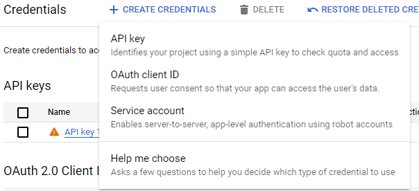
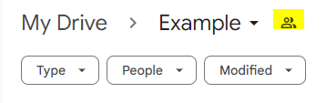

# This is a simple program to move files from one folder of Google Drive account to another.

### For this program to run you are required to create a google console project and enable Google Drive API and create credentials of Service account.

### Then take the Email given in service account and share it with the Source Folder and Destination Folder

